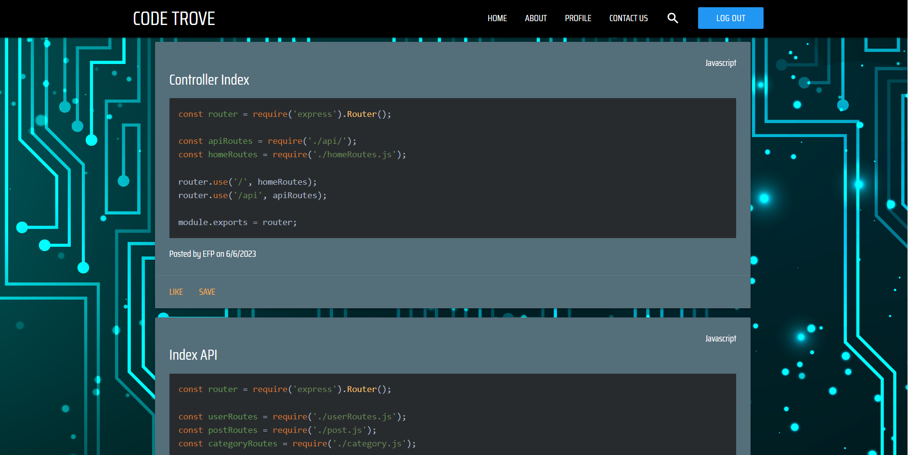
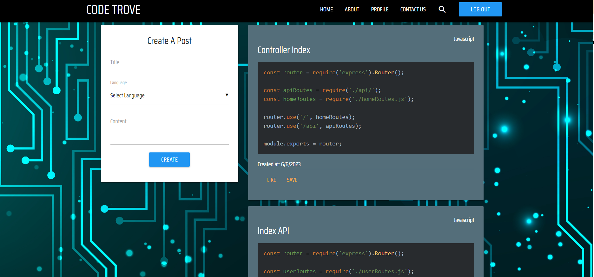

# Code Trove - Code Snippet Manager

https://opensource.org/licenses/MIT

GitHub Repository: https://github.com/EFP18/Code-Trove

Deployed in Heroku: https://code-trove.herokuapp.com/

## Table of Contents

- [Screenshots](#screenshots)
- [Description](#description)
- [Installation](#installation)
- [Usage](#usage)
- [License](#license)

## Screenshots

## Description

Code Trove is a website that targets an audience of coders of all levels. It provides them with a platform where they can open an account and save important code snippets, boilerplate code, and more, in their profile, as well as share their snippets with other coders.

## Installation

In order for a user to run our project locally, they need to have `VS Code` installed. Once they open the project on `VS Code`, they need to install all the necessary dependencies by typing `npm i`. Then, the user needs to type `npm start`, which will activate their localhost, at which point the website can be accessed online, (locally), by typing http://localhost:3001/ in the URL field.

The project is deployed using `Heroku`, so anybody can access the website through the link mentioned above.

## Technologies Used

- `Node.js` and `Express.js` - Create RESTful API.
- `Handlebars.js` as template engine.
- `MySQL` and `Sequelize ORM`.
- This project follows an `MVC` paradigm.
- Environment variables to protect API keys and sensitive information.
- Two external libraries, namely `Highlight.js` and `getform.io`.

## Usage

To give coders a platform where they can save code-notes, and share them with other fellow coders.

## License

MIT

## Future Development
- Like and Save functionality.
- Pin posts at the top of the page. 
- Add functionality to the search button.
- Option to have a public or a private profile and/or post.